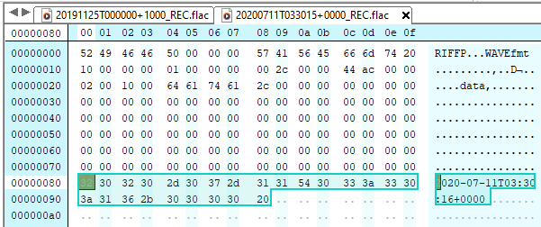

# Preallocated headers (near-empty corrupt files)


| Problem ID | Manufacturer  | Affected Firmware                        | Affected Hardware | Status        |
| ---------- | ------------- | ---------------------------------------- | ----------------- | ------------- |
| FL001      | Frontier Labs | unknown: at least most versions of v3.0+ | BAR               | Minor problem |

Often when a sensor is interrupted - through a fault, lack of space, or a power failure, fragments of files 
produced and left in the file system.

These fragments are often:

- Occurs for both WAVE and FLAC files
- small but not empty; usually around 153 bytes for FLAC files and 44 bytes for WAVE files
- contain a `RIFF` and `WAVE` header, even if the recording format is FLAC
- and often contain incoherent or misplaced data
   - for example: a FLAC comment could be in the `data` section of a `WAVE` struct



There is no usable information on these files and they cannot be reliably repaired.

Since these files are regularly produced, and for we suspect a variety of reasons this issue may be
reflective of several smaller issues.

## Status

**Minor problem**: most tools fail to process these files,
they are mainly an annoyance, especially since at a surface level they look like small
but valid files.

## Status with vendor

It was suggested to FL they should attempt to clean up or delete such files, but this was a long time ago.
No recent contact about this issue has been attempted.

## Effects of the problem on common tools

### EMU

Emu has support for detecting this problem and renaming problem files: <https://github.com/QutEcoacoustics/emu/blob/master/docs/fixes.md#rename-stub-files-fix-fl001>

### Acoustic Workbench (Ecosounds, A2O)

Currently fail - ungracefully - to harvest files

### ffmpeg/ffprobe

Will generally produce a variety of errors such as:

```
[pcm_s16le @ 0x5575904db580] PCM channels out of bounds
    Last message repeated 1 times
[wav @ 0x5575904d9ac0] Failed to open codec in avformat_find_stream_info
[wav @ 0x5575904d9ac0] Estimating duration from bitrate, this may be inaccurate
[wav @ 0x5575904d9ac0] Could not find codec parameters for stream 0 (Audio: pcm_s16le ([1][0][0][0] / 0x0001), 11264 Hz, 0 channels): unspecified number of channels
Consider increasing the value for the 'analyzeduration' and 'probesize' options
Input #0, wav, from '/data/harvester_to_do/harvest_28/sdfsdf/20211129_79/314/785/20200711_STUDY/20200711T033015+0000_REC.flac':
  Duration: 00:00:00.00, bitrate: 492 kb/s
    Stream #0:0: Audio: pcm_s16le ([1][0][0][0] / 0x0001), 11264 Hz, 0 channels
[pcm_s16le @ 0x5575904de800] PCM channels out of bounds
Could not open codec for input stream 0
```

The metadata command will also report roughly correct values (0 duration, 0 samples) for these files.

## Examples

https://cloudstor.aarnet.edu.au/plus/s/hrmQPSrkqV0Evvv?path=%2Ffrontier_labs%2FFL001