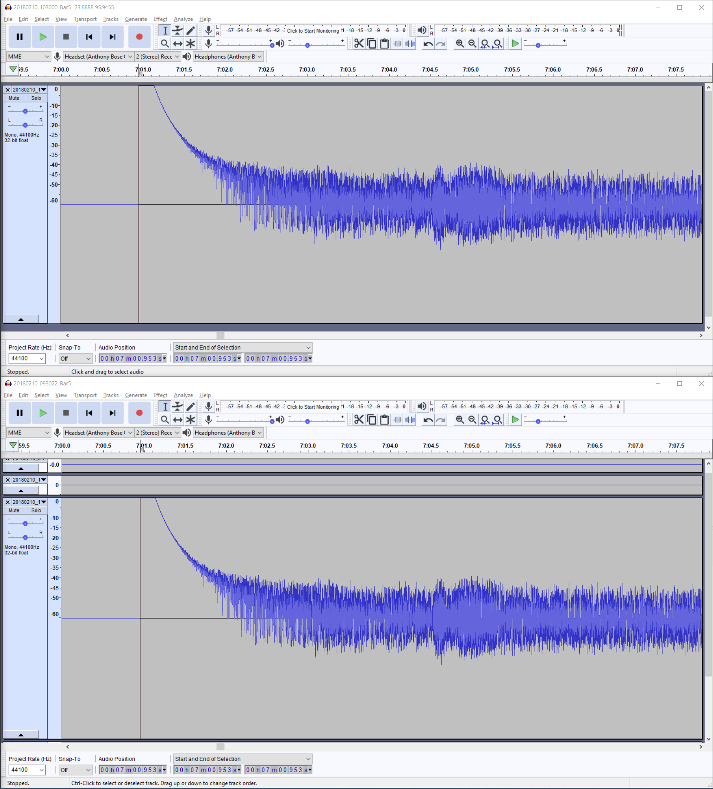

# Empty blocks of audio data

| Problem ID | Manufacturer  | Affected Firmware | Affected Hardware | Status        |
| ---------- | ------------- | ----------------- | ----------------- | ------------- |
| FL002      | Frontier Labs | 2.99              | BAR               | Minor problem |

Sometimes BARs start recording but no actual signal is recorded, until at some point
it starts being captured. Even though there is no signal, some digital noise is captured, indicating that the
sensor does think it is recording.

The simplest answer is that the microphone is either faulty or not attached.
Normally we'd see some indication of the microphones health in the log files but
in this case there's no mention of anything about the microphone. 

We've encountered two cases of this oddity, both with the same sensor:
- In the first case, the recording started capturing true
signal at 00:07:00.953 into the recording
- In the second case, the recording started capturing true
signal at 00:07:00.953 into the recording. Though in this case the first two 30
minute recordings captured no signal at all.

The fact that both recordings started capturing signal within one millisecond
leads me to believe this not simply a microphone connection issue.

## Status
**Minor Problem** It most likely is just damaged hardware. This is mainly being
documented in case we discover the behaviour again.

## Status with vendor

FL is not aware of the issue.

## Effects of the problem on common tools

### Acoustic Workbench (Ecosounds, A2O)
It varies:

-   Most recent update: There was a bug with our background noise calculation in AP.exe
    which has been resolved <https://github.com/QutEcoacoustics/audio-analysis/issues/187>
-   We harvest and manipulate these files without error
-   We should be doing better QA for incoming audio and then rejecting or
    trimming files that have periods of silence in them.
