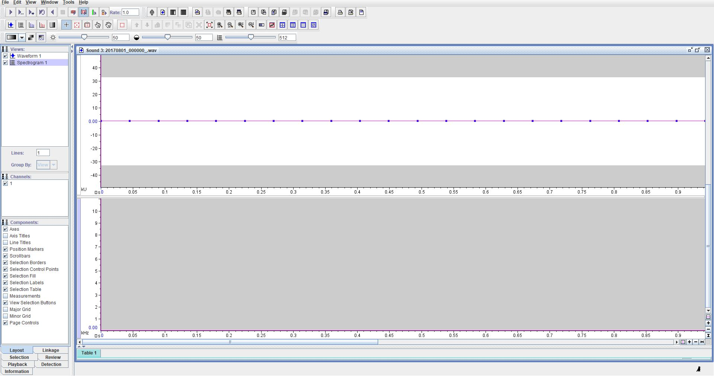
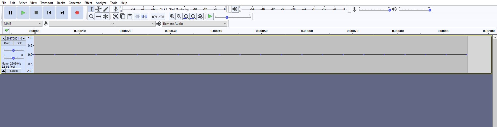

# Generating corrupt full-size files

| Problem ID | Manufacturer  | Affected firmware | Firmware fix | Affected hardware | Status        |
| ---------- | ------------- | ----------------- | ------------ | ----------------- | ------------- |
| FL003      | Frontier Labs | 2.2; 2.5; 2.8     | 3.00         | BAR               | Minor problem |

The BARs produce audio files that are full-size but only have partial data
written to them.

An example: There were 4 sensors, at 4 sites, and the last recording from each
site experienced this "corruption". Each of the four files appears to have two
things wrong with them:

-   The _Subchunk2Size_ field (offset at byte `40`) in the WAV header is set to
    `0x0000002c` (`44` decimal) when it should be much much larger
-   And each of the files seems to be only partially written - after some
    point only empty bytes (`NUL`s / zeroes) are present in the file

The likely cause is a sensor running out of battery life and shutting down
(confirmed by FL). Apparently, the files are pre-allocated (hence the empty
bytes at the end) and the _SubChunk2Size_ field is written only at the end of the
writing process.

The result of the malformed header means that SoX reports absolutely absurd
sample rates for recordings (e.g. `5.4 Terasamples per second` or 
`34.4 Terasamples per second`).

## Status

**Minor Problem** - this problem no longer occurs in firmwares greater than `3.00`.

Any files produced with older firmwares still have issues though.

## Status with vendor

Vendor has patched the problem in firmware `3.00`.

Outdated  notes:

> Have contacted Frontier Labs, but they don’t see it as a problem
– if it is always the last file in the deployment then"_that the second last
file is the last correct file_". Recommended changing the file extension of an in
progress file being written to a `.partial` extension – this would allow easy
filtering of the partially written files. Unsure if they plan to deal with it.

Additionally, these files should have recoverable WAV data in them but we don’t
yet have a tool that can repair them.

## Effects of the problem on common tools
### Acoustics Workbench (Ecosounds, A2O)
It can vary:

-   SoX usually reports massive bit rates and sometimes it detect
    this as invalid and fail when processing the file
-   When harvesting the files get rejected because they are "too short".
    This is actually a misnomer: they are too short because the sample rate is so high that their reported duration is ~0 seconds. They aren't harvested but a better error message would be ideal. Tracking issue:
    <https://github.com/QutBioacoustics/baw-workers/issues/63>
-   Sometimes the files pass by our initial validation. 

### AnalysisPrograms.exe: **No**
- This leads to an OutOfMemoryException. Tracking issue:
    <https://github.com/QutBioacoustics/audio-analysis/issues/141>
-  Our tools have no way to detect these files without trying to read them
-  We have no method for repairing these files – they mostly have valid
    data
    
### Raven Pro
- The software opens the file but doesn't show any data

### Audacity
- Similar to Raven, the software opens the file but doesn't show any data

## Examples

https://cloudstor.aarnet.edu.au/plus/s/hrmQPSrkqV0Evvv?path=%2Ffrontier_labs%2FFL003
