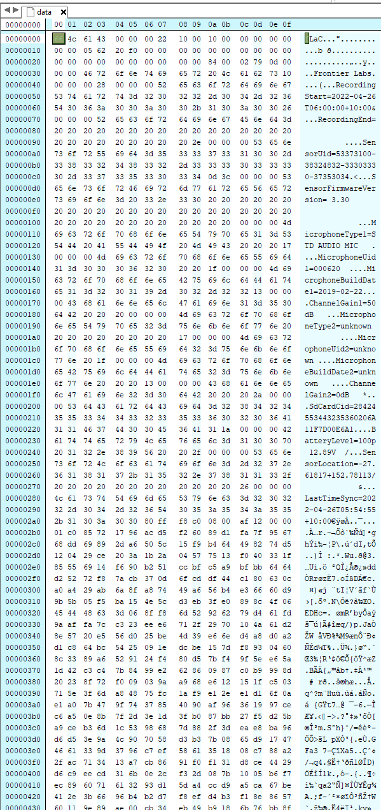

# Partial files named `data`

| Problem ID | Manufacturer  | Affected Firmware | Fixed in firmware | Affected Hardware | Status            |
| ---------- | ------------- | ----------------- | ----------------- | ----------------- | ----------------- |
| FL011      | Frontier Labs | 3.30              | N/A               | BAR-LT            | Intended behavior |

Related to [FL003](./FL003.md).

It appears FL now write temporary files to partial extension-less `data` files.

It looks like most of the file is a valid audio file:

Open questions: 

- Does this occur for WAVE recordings too?
- Can these files be repaired?
- The log file makes no mention of these files, but it does mention files that should be present, but aren't.

Notes:
- There are various problems that can occur with these files
- We've seen examples of:
  - partial files that are just empty
  - partial files that contain FLAC frames for the whole file (almost fully recoverable)
  - partial files that contain FLAC frames for the first part of the file, but have other data (WAVE samples???) in the rest of the file!

## Status

**Intended behavior**: The sensor produces these `data` files while recording.
In the event of an unexpected interruption to recording the `data` file is not renamed to it's final name
thus omitting it from most filename based filters.

There is still potential to repair these files.

We considered merging [FL003](./FL003.md) with [FL011](./FL011.md) but although related the production
of `data` partial files is a unique behavior.

## Status with the vendor

FL has verified this behavior is intentional.

The suggestion from [FL003](./FL003.md) to append a `.partial` suffix to normal file names was not adopted.

## Effects on common tools

### Acoustic Workbench (Ecosounds, A2O)

Currently fail - ungracefully - to harvest files

### ffmpeg/ffprobe

ffprobe seems to process the file with no issues.

### EMU

Emu can partially repair these partial files. See https://github.com/QutEcoacoustics/emu/blob/master/docs/fixes.md

## Examples

https://cloudstor.aarnet.edu.au/plus/s/hrmQPSrkqV0Evvv?path=%2Ffrontier_labs%2FFL011
