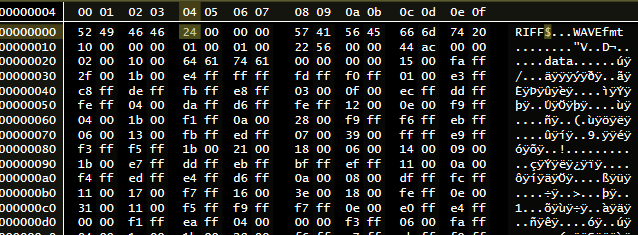

# Data chunk size is zero

| Problem ID | Manufacturer  | Affected Firmware | Fixed in firmware | Affected Hardware | Status        |
| ---------- | ------------- | ----------------- | ----------------- | ----------------- | ------------- |
| FL012      | Frontier Labs | 3.01              | N/A               | BAR?              | draft/unknown |

Related to [FL003](./FL003.md) and [FL005](./FL005.md), however it seems distinct since the files are.

We've been given a sample of a file that is from a FL sensor but that has a `data` chunk value of `0`.
Additionally, the RIFF chunk size is `36`.

Otherwise the file seems to be fine - there seems to be valid samples right through the file (not typical
of [FL003](./FL003.md) and it is a full-size file (`158,535,680` bytes)).

Note the value of the `0x00_00_00_24` (`36`) just after `RIFF` and the value `0x00_00_00_00` (`0`) just after
`data`.

Open questions: 

- Is this a variant of [FL005](./FL005.md)?
  - I've not grouped it in because in theory FL005 has been fixed
  - and because `data` size was always `44` in that issue
- Is this a one-off. So far we've seen no other reports of this oddity

## Status

**Unknown**: non-replicated problem

## Status with the vendor

Vendor has not been contacted

## Effects on common tools

### Acoustic Workbench (Ecosounds, A2O)

Currently fail - ungracefully - to harvest files.

### Audacity

Fails to open the file

### AP/various R tools

Fail to read the files - after reading 0 for data chunk size the tools infer 0 samples and don't/can't process any data.

### ffmpeg/ffprobe

ffprobe can ignore the bad chunk size and estimate the duration of the file.

sox does not report the duration.

### EMU

Emu has no support for this problem. Tracking issue: <https://github.com/QutEcoacoustics/emu/issues/254>

## Examples

No publicly available samples have been released. Please contribute.

https://connectqutedu.sharepoint.com/sites/QUTEcoacousticsAnon/Shared%20Documents/Forms/AllItems.aspx?id=%2Fsites%2FQUTEcoacousticsAnon%2FShared%20Documents%2Fknown%2Dproblems%2Ffrontier%5Flabs%2FFL012
