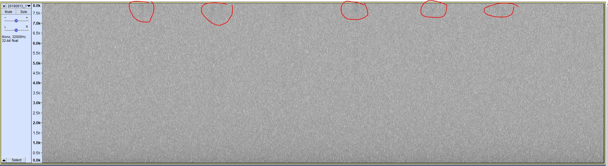
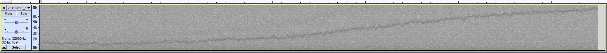

# Interference in Audio Files

|Problem ID | Manufacturer | Firmware changes | Status              |
|-----------|--------------|------------------|---------------------|
|OA01         |Open Acoustics Device |                  |   Major problem     |

Audiomoths data can have some interferences on them. There are two main types of interferences generated:

## 1. "Clicks"

Appear every half a second or so, usually more visible on the higher frequencies and it consists in a intermitent click sound.

### Example:

### Status:
**Major problem**

OAD says this is due to writing data on the SD cards and that using high quality SD cards should solve the issue. However, even changing SD cards to the recommended ones the problem persisted (the sound was lower but still present).

## 2. "Insect like" interference

This type of interference appears suddenly on recordings and there is no clear pattern or reason for that. It consists on a tracking line that goes up and down the frequency bands for a long time (hours). It starts and finishes randomly and it also does not appear at every recorder. If you're insepcting the recording in a small resolution (i.e.: 1 minute window) it looks like an insect track. It gets really weird when checking larger window sizes, like 30 minutes or 1 hour recordings.

Several tests were conducted trying to reproduce this interference, however none of them demonstrated any consistency, pattern of explanation.

## Status:
**Major problem**

This interference will affect acoustics indices, recognisers and almost every semi/automatic tool for data processing. OAD was contacted but no solution or explanation was found.

## Example:

