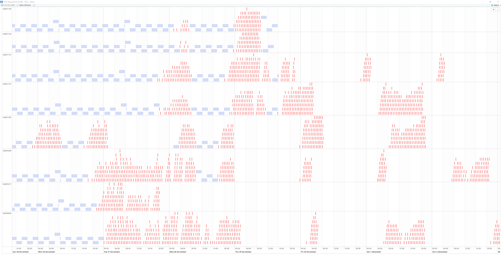

# Generating Files with No Data

|Problem ID | Manufacturer      | Affected Firmware| Affected hardware | Status              |
|-----------|-------------------|------------------|-------------------|---------------------|
|WA002         |Wildlife Acoustics |      Unknown            |   SM4, SM3          |Major problem     |

At some point during a deployment, the SM4s start generating small files, each
about 128KB, each filled with `NUL` bytes. ~~Probable cause: SD card full.~~

We now believe the cause is low power from the main batteries.

Update: For one deployment of 8 sensors we saw this problem a lot.

## Details: 
> TL;DR: there are two weeks of good data, and the third week is a write-off.
> 
> - All the corrupt files happen towards the end of the deployment
> - There are 5121 corrupt files and 1608 valid files
> - The corrupt files did not take up too much space (only 380MB across all of the sensors)
> - Data collection is good for all sensors from Monday 12th November through to Monday 26th of November
> - The first sensor fails on the 26th
> - The last sensor fails on the 2nd of December
> - The last valid recording is 12:00 on the 
> - Naively I would guess the sensors are running out of storage space
> - However, after failures start occurring some successful files still get recorded
> - The sensor tries to repeatedly record again when a file fails to record
> - If these sensors were running off solar power this behaviour would make sense.

## Examples:

[Example files](https://cloudstor.aarnet.edu.au/plus/s/hrmQPSrkqV0Evvv?path=%2Fwildlife_acoustics%2FWA002)

## Status

**Major Problem**

## Status with vendor

Not yet contacted WA

## Effects of the problem on common tools

### Acoustics Workbench (Ecosounds, A2O):
- FFMPEG reports the file has having invalid data. "Invalid data found
when processing input" so data can't be harvested

## Workarounds

Filter out small files (less than 500KB) when analysing data.
