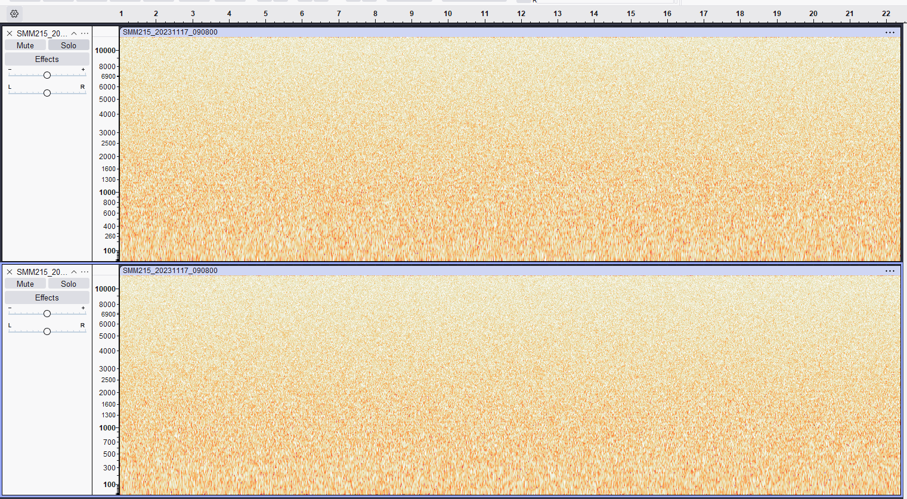
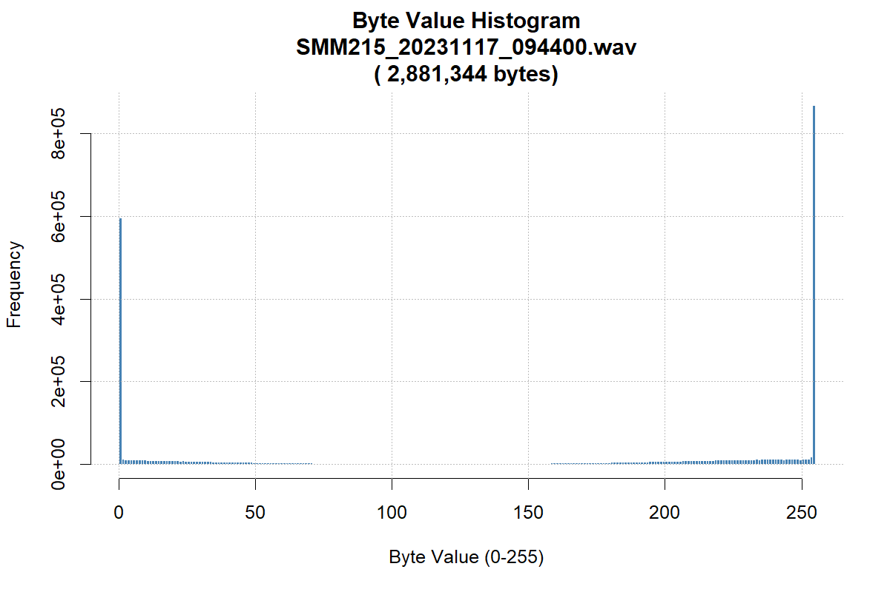
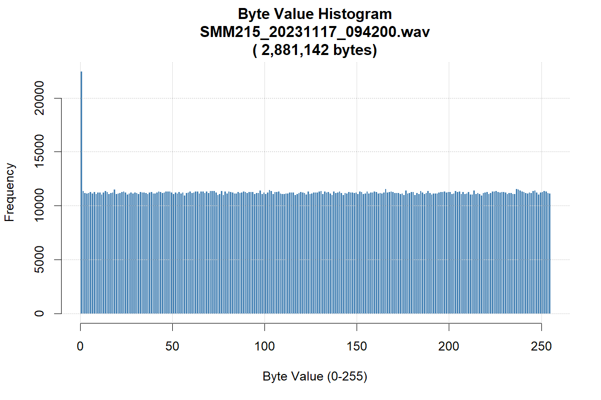
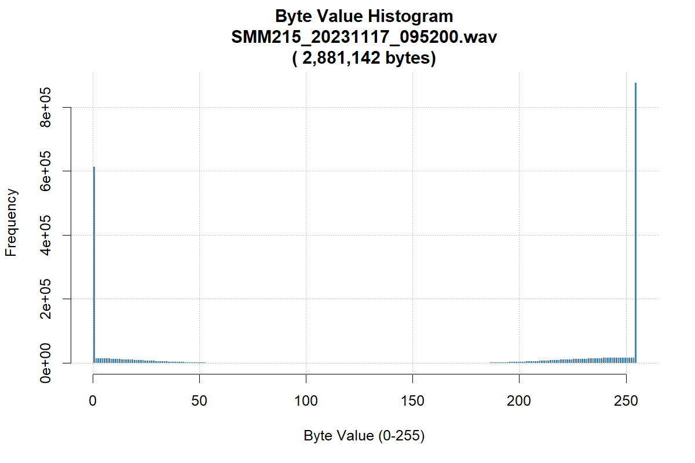

# Generating corrupt files

| Problem ID | Manufacturer       | Affected Firmware | Affected hardware | Status        |
| ---------- | ------------------ | ----------------- | ----------------- | ------------- |
| WA004      | Wildlife Acoustics | 3.4?              | Song Meter Mini   | Minor problem |

At some point during a deployment, the Song Meter Minis start generating
files that are:

- the exact same size as other files in the deployment
- they are full of bytes
- there are no headers or other structures in the file (e.g. there is a missing guano chunk as well).
- the bytes do not exhibit any structure that could be understood to be samples

## Examples:

[Example files](https://connectqutedu.sharepoint.com/:f:/s/QUTEcoacousticsAnon/EkoJrb-ziFFFq1PinSdeu0sBF1wcUoQxtRXT4RgwK5KtDg?e=QF5LaQ)

For the corrupt files, importing them in Audacity as raw samples generates noise:

The import raw option was used with the settings the sensors used (24000Hz, 1-channel, 16-bit PCM).
Even with a 1-byte offset, we only observed noise.

(0 and 1 byte offsets shown, respectively).

This indicates the problem is just a generation of samples in the file without a header and that the data is not recoverable.

Further, a missing header would actually show blank spots, or should result in a smaller file if the header was omitted or truncated.
Neither of these are true.

Lastly, when comparing a distribution of bytes in good files vs bas files, we see that the data
seems to be a almost perfect distribution of bytes. This is unusual; any well structured file
is actually not well-distributed, with values clustering around 0 and 256 (the high byte is the 
sign bit for negative two-value samples).

| Bad                                                             | Good                                                             |
| --------------------------------------------------------------- | ---------------------------------------------------------------- |
|  |  |
|  |  |
|  |                                                                  |

## Status

This is a **Minor Problem**.

The data is not recoverable, but the problem does not occur often.
Additionally all tools will fail to read these files quickly.
(It would be worse if the tools timed out, crashed, or hung.)

The files are best filtered from datasets.

## Status with vendor

Not yet contacted WA

## Effects of the problem on common tools

### Acoustics Workbench (Ecosounds, A2O):

- FFMPEG reports the file has having invalid data. "Invalid data found
when processing input" so data can't be harvested

### Audacity

> Could not open file <path>: Incorrect filetype.

## Fixes

Coming to EMU Soon.
